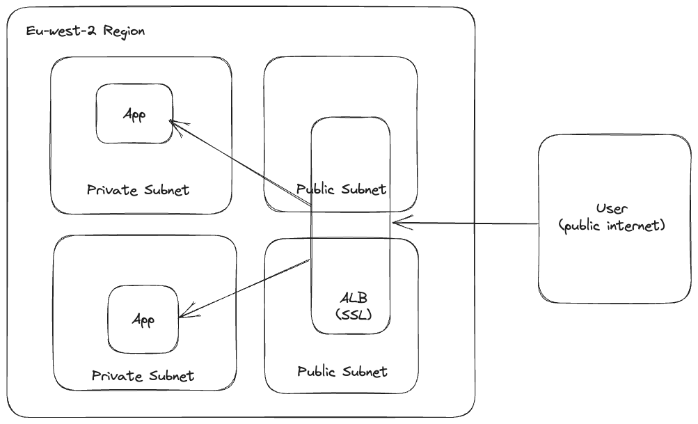

# Arbor Tech Test Documentation
Terraform implementation of the Arbor Tech Test

## Decisions Made

- Use Remote State to allow multiple engineers to work simultaneously
- Use Community modules to simplify/abstract away (particularly vpc config)
- Use tfsec to report and improve security posture, implementing into ci/cd to prevent security flaws being introduced
- Use CI/CD to release tf, running tests (validate/tfsec etc)
- Use multiple AZs with an ALB to allow for a HA setup and failure of at least one AZ
- Application run in private subnets with only load balancer public facing
- Use NAT Gateway to allow application internet access if required
- Use Cloudwatch metric alarms / lifecycle hooks to act when success rates fall and responses times rise (scale up on error rate increase, slowing response times)
- tfdocs to generate documentation

## Common Tasks

### Setup

- Remote State Setup

``` console
cd remote-state
terraform init
terraform apply
```

### Dev

- Project init

``` console
terraform init
terraform workspace new dev
terraform plan -var-file=config/dev.tfvar
terraform apply -var-file=config/dev.tfvar
```

- Running out tf

``` console
terraform workspace select dev
terraform plan -var-file=config/dev.tfvars
terraform apply -var-file=config/dev.tfvars
```

## Todo

- [x] Code Tidy
- [x] tfsec run - static code analysis for terraform stack
- [ ] Add SSL Functionality to ALB - Currently not possible in my sandbox environment
- [ ] Autoscaling based upon metrics for Response Time
- [ ] Autoscaling based upon metrics for Success Rate - 5xx
- [ ] Add all tfsec rules for fix/ignore
- [ ] Migration to Containers - Faster scale up
- [ ] Load Testing - Not possible against nginx welcome page - Gatling
- [ ] github actions ci/cd - Potentially on push to main - apply

4000 schools * 20 classes * 30 peoples = Up to 80,000 registers being submitted around 930am ~ 3 million api calls
Potential for use of SQS or other queueing service to reduce write requirements to the database
Redis/Memcache to cache reads of class list

## tfdocs

## Requirements

No requirements.

## Providers

| Name | Version |
|------|---------|
| <a name="provider_aws"></a> [aws](#provider\_aws) | 5.6.2 |

## Modules

| Name | Source | Version |
|------|--------|---------|
| <a name="module_alb"></a> [alb](#module\_alb) | terraform-aws-modules/alb/aws | 8.7.0 |
| <a name="module_asg"></a> [asg](#module\_asg) | terraform-aws-modules/autoscaling/aws | 6.10.0 |
| <a name="module_vpc"></a> [vpc](#module\_vpc) | terraform-aws-modules/vpc/aws | 5.0.0 |

## Resources

| Name | Type |
|------|------|
| [aws_cloudwatch_log_group.vpn_endpoint_logs](https://registry.terraform.io/providers/hashicorp/aws/latest/docs/resources/cloudwatch_log_group) | resource |
| [aws_cloudwatch_log_stream.vpn_endpoint_stream](https://registry.terraform.io/providers/hashicorp/aws/latest/docs/resources/cloudwatch_log_stream) | resource |
| [aws_cloudwatch_metric_alarm.elb_5xx_alarm](https://registry.terraform.io/providers/hashicorp/aws/latest/docs/resources/cloudwatch_metric_alarm) | resource |
| [aws_security_group.nginx](https://registry.terraform.io/providers/hashicorp/aws/latest/docs/resources/security_group) | resource |
| [aws_sns_topic.my_topic](https://registry.terraform.io/providers/hashicorp/aws/latest/docs/resources/sns_topic) | resource |
| [aws_ami.amazon](https://registry.terraform.io/providers/hashicorp/aws/latest/docs/data-sources/ami) | data source |

## Inputs

| Name | Description | Type | Default | Required |
|------|-------------|------|---------|:--------:|
| <a name="input_environment"></a> [environment](#input\_environment) | Environment | `string` | n/a | yes |
| <a name="input_private_subnets"></a> [private\_subnets](#input\_private\_subnets) | A list of private subnets inside the VPC | `list(string)` | n/a | yes |
| <a name="input_public_subnets"></a> [public\_subnets](#input\_public\_subnets) | A list of public subnets inside the VPC | `list(string)` | n/a | yes |
| <a name="input_vpc_cidr"></a> [vpc\_cidr](#input\_vpc\_cidr) | CIDR for VPC | `string` | n/a | yes |

## Outputs

| Name | Description |
|------|-------------|
| <a name="output_load_balancer_dns"></a> [load\_balancer\_dns](#output\_load\_balancer\_dns) | n/a |

## Architecture Diagram

